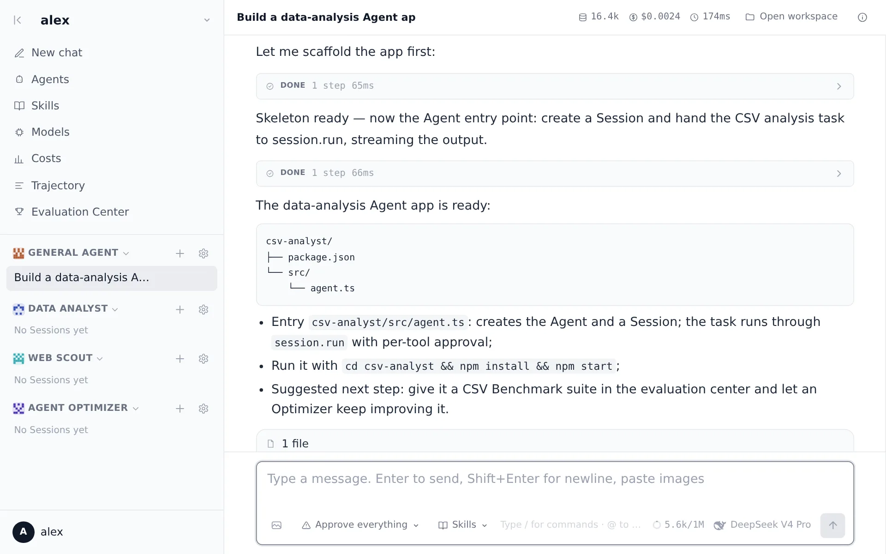

<p align="center">
  
</p>

<h1 align="center">PenguinHarness</h1>

<p align="center"><b>Efficient Self-Improving Harness for Everyone</b></p>

<p align="center">
  Open-source, local-first infrastructure that builds AI agents for you —
  from automatic agent construction to recursive self-improvement.
</p>

<p align="center">
  <a href="https://github.com/Prism-Shadow/penguin-harness/actions/workflows/ci.yml"></a>
  <a href="https://github.com/Prism-Shadow/penguin-harness/actions/workflows/pages.yml"></a>
  <a href="LICENSE"></a>
  = 24" />
</p>

<p align="center">
  English | <a href="README.zh.md">简体中文</a> ·
  <a href="https://penguin.ooo/">Website</a> ·
  <a href="https://penguin.ooo/docs/">Docs</a> ·
  <a href="https://penguin.ooo/blog">Blog</a>
</p>

<p align="center">
  <picture>
    <source media="(prefers-color-scheme: dark)" srcset="packages/landing/src/assets/shots/chat-en-dark.webp" />
    
  </picture>
</p>

---

## Why PenguinHarness

- **Simplest Is the Best** — a deliberately minimal toolset over clean low-level interfaces: fewer tool calls, fewer tokens, complex tasks done efficiently.
- **Harness for Building Agents** — with the PenguinHarness SDK, an Agent builds complete Agent applications for you, autonomously, from scratch.
- **Harness for Recursive Self-Improvement** — with PenguinHarness Skills, an Agent evaluates and optimizes itself: benchmark, find the lost points, ship version N+1, snapshot before every round.
- **Local-first and lightweight** — 100% open source, runs on a single CPU, your data never leaves the machine. 1000+ online and local models reachable through one gateway.
- **Everything observable** — every request, tool call and approval decision lands in an append-only Trace; any Session can be resumed from it.

## Quickstart

Install with one command (Linux / macOS, x64 / arm64, bundled Node runtime):

```bash
curl -fsSL https://github.com/Prism-Shadow/penguin-harness/releases/latest/download/install.sh | sh
```

Or via npm (requires Node >= 24; the command it installs is `penguin`):

```bash
npm install -g @prismshadow/penguin-cli
```

Then launch the Web App — or stay in the terminal:

```bash
penguin web        # start the service and open http://127.0.0.1:7364 (first login: admin / admin123)
penguin server     # same service, headless

# configure a model once (or use the in-app Models page)
penguin config model add --model-id deepseek-v4-pro --api-key sk-... --set-default

penguin run -m "Create hello.txt containing Hello, Penguin"   # one-shot task
penguin chat       # interactive REPL (/compact, /exit, Ctrl-C to interrupt)
```

Using the SDK directly:

```ts
import { createAgent, isCompleteModelMessage, userText } from "@prismshadow/penguin-core";

const agent = await createAgent({ agentId: "default_agent" });
const session = await agent.createSession({ workspaceDir: process.cwd() });

for await (const output of session.run([userText("Create hello.txt containing hi")], {
  approve: async () => "allow", // per-tool-call approval
})) {
  if (isCompleteModelMessage(output) && output.payload.type === "text") {
    console.log(output.payload.text);
  }
}
```

## What's inside

A pnpm monorepo (TypeScript, Node >= 24). One install ships four layers that share a single data directory (`~/.penguin/data`) and a single message protocol (OmniMessage):

| Package | Name | Role |
| --- | --- | --- |
| [`packages/core`](packages/core) | `@prismshadow/penguin-core` | SDK & engine: ReAct loop, OmniMessage protocol, LLM/Environment interface contracts, Agent State, Trace |
| [`packages/cli`](packages/cli) | `@prismshadow/penguin-cli` | The `penguin` command: REPL, one-shot runs, model & vault config, service launcher |
| [`packages/server`](packages/server) | `@prismshadow/penguin-server` | Web backend: HTTP API + SSE streaming, multi-user auth, Project authorization, usage stats |
| [`packages/web`](packages/web) | `@prismshadow/penguin-web` | Web App: multi-session chat, Agent/skill/model management, Trace observability, evaluation center |
| [`packages/skills`](packages/skills) | `@prismshadow/penguin-skills` | Built-in skill library (agent creation, benchmarking, evaluation, optimization, …) |
| [`packages/landing`](packages/landing) | — | Product landing page (this repo's website) |
| [`packages/docs`](packages/docs) | — | Documentation site (bilingual, deployed under `/docs/`) |

Responsibilities split by source of truth: the **SDK** owns protocol and execution (message parsing, the agent loop, tools), the **Server** owns the multi-user runtime (auth, SSE streaming, scheduled tasks), and the **file layer** under `~/.penguin/data` owns everything editable and recorded (prompts, Skills, secrets, Traces). The full design-by-design map is in [Architecture → Division of responsibilities](https://penguin.ooo/docs/architecture).

## Documentation

The docs site covers both usage and design: [Introduction](https://penguin.ooo/docs/) · [Quickstart](https://penguin.ooo/docs/quickstart) · [Architecture](https://penguin.ooo/docs/architecture) · [The OmniMessage Protocol](https://penguin.ooo/docs/omni-message) · [Core Interfaces](https://penguin.ooo/docs/interfaces) · [The Agent Loop](https://penguin.ooo/docs/agent-loop) · [CLI Reference](https://penguin.ooo/docs/cli) · [Server API](https://penguin.ooo/docs/server-api) · [Configuration](https://penguin.ooo/docs/configuration)

Every doc page has a "Copy Markdown" button, so you can paste it straight into a model context.

## Development

```bash
pnpm install
pnpm build       # build first: core's exports point at dist/
pnpm typecheck
pnpm test

pnpm dev:server  # backend at 127.0.0.1:7364
pnpm dev:web     # web app (Vite) at 127.0.0.1:7365, /api proxied
pnpm dev:docs    # docs site (Vite) at 127.0.0.1:7367

BASE_PATH=/ pnpm build:site   # assemble landing + docs exactly like the Pages deploy
```

Copy `.env.example` to `.env` for model credentials in development. E2E tests run against a live model (`pnpm test:e2e`, needs `DEEPSEEK_API_KEY`).

## License

[Apache-2.0](LICENSE) © 2026 Prism Shadow
