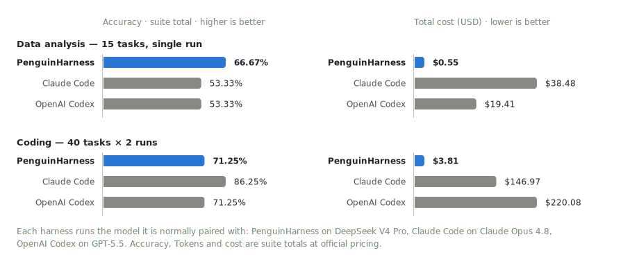
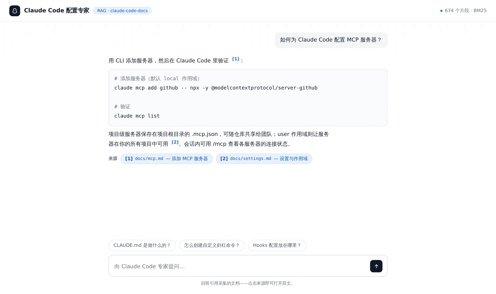

<p align="center">
  
</p>

<h1 align="center">PenguinHarness</h1>

<p align="center"><b>使用 LangChain，以 1 倍速度人工构建 Agent；<br />使用 PenguinHarness，以 100 倍速度用 Agent 构建 Agent。</b></p>

<p align="center">零代码 Harness CLI 与 Web UI，连接 1000+ 模型。</p>

<p align="center">
  <a href="https://github.com/Prism-Shadow/penguin-harness/actions/workflows/ci.yml"></a>
  <a href="https://github.com/Prism-Shadow/penguin-harness/actions/workflows/pages.yml"></a>
  <a href="LICENSE"></a>
  = 24" />
</p>

<p align="center">
  <a href="https://penguin.ooo/"></a>
  <a href="https://penguin.ooo/docs/"></a>
  <a href="https://penguin.ooo/blog"></a>
</p>

<p align="center">
  <a href="https://discord.gg/eFHKqqcU3D"></a>
  <a href="https://x.com/code_hiyouga"></a>
  <a href="https://github.com/Prism-Shadow/penguin-harness-community/blob/main/wechat/group.jpg"></a>
</p>

<p align="center"><a href="README.md">English</a> | 简体中文</p>

## 为什么选择 PenguinHarness

三个递进的理由——从任务效果，到构建方式，再到进化能力。

### 1. 🏆 复杂任务表现更好，成本更低

刻意精简的工具集配合干净的底层接口：更少的工具调用、更少的 Token——效果更好，成本更低，对 DeepSeek 等开放模型深度适配。同一模型、同一批任务，正面对比：

<p align="center">
  <picture>
    <source media="(prefers-color-scheme: dark)" srcset="assets/readme/benchmark-dark.svg" />
    
  </picture>
</p>

<sub>数据分析：15 题单次运行，美元计价。编程：40 题 × 2 次取均值，官方人民币定价按 $1 = ¥7 折算。完整数据见<a href="https://penguin.ooo/">官网</a>。</sub>

### 2. ⚡ 一句话，让 Agent 构建 Agent 应用

输入一句话，Agent 为你构建完整的 Agent 应用——脚手架、代码、运行说明，一步到位：

```text
收集 https://github.com/ericbuess/claude-code-docs 的文档，做一个化身 Claude Code 配置专家、回答带来源引用的 RAG 问答应用。
```

这是做出来的成品——一个文档专家：检索增强、引用可点击直达原文、内置示例问题：

<p align="center">
  <picture>
    <source media="(prefers-color-scheme: dark)" srcset="assets/readme/rag-app-zh-dark.webp" />
    
  </picture>
</p>

### 3. 🧬 自进化，越用越强

借助 PenguinHarness 技能库，Agent 自己评估、自己优化：跑 Benchmark、找失分点、发布 N+1 版——每轮之前自动快照，每个请求都可在轨迹观测中回放。

<!-- TODO: 自进化演示视频——即将提供。 -->

## 支持的模型

| 模型             | 可用供应商                                                                       |
| ---------------- | -------------------------------------------------------------------------------- |
| DeepSeek V4      | DeepSeek, OpenRouter, Fireworks AI, SiliconFlow, Qwen Token Plan                 |
| Kimi K3          | Moonshot AI, OpenRouter, Qwen Pay-As-You-Go                                      |
| GLM 5.2          | Z.AI, OpenRouter, Fireworks AI, SiliconFlow, Qwen Token Plan, Qwen Pay-As-You-Go |
| Hunyuan 3        | OpenRouter                                                                       |
| Qwen 3.8 Max     | Qwen Token Plan（预览）                                                          |
| GPT 5.5          | OpenAI, OpenRouter                                                               |
| Gemini 3.5 Flash | Google Gemini, OpenRouter                                                        |
| Claude Opus 4.8  | Anthropic, OpenRouter                                                            |

只要是 OpenAI 协议的端点都可以接入：从上表选择预置，或用自定义端点连接 1000+ 在线与本地模型。

## 系统需求

| 需求项   | 支持情况                                          |
| -------- | ------------------------------------------------- |
| 操作系统 | Linux、macOS                                      |
| 架构     | x64、arm64                                        |
| 运行时   | 一行安装器自带（经 npm 安装需 Node >= 24）        |
| 模型     | 至少一个模型的 API key                            |

## 安装

### 🌐 Web 应用——面向人

🚀 一行安装，启动完整体验（多会话对话、Agent / 技能 / 模型管理、用量统计、轨迹观测、评估中心）：

```bash
curl -fsSL https://penguin.ooo/install.sh | sh
penguin web        # 启动服务并打开 http://127.0.0.1:7364（首次登录：admin / penguin-2026）
```

📦 或经 npm 安装：`npm install -g @prismshadow/penguin-cli`。在应用内模型页配置模型后即可对话。

### 🤖 CLI 与 SDK——面向 Agent

同一引擎、可脚本化——为被 Agent 驱动而生（以及让 Agent 构建 Agent）：

```bash
penguin config model add --model-id deepseek-v4-pro --api-key sk-... --set-default
penguin run -m "Create hello.txt containing Hello, Penguin"   # 单次任务
penguin chat       # 交互式 REPL（/compact、/exit、Ctrl-C 中断）
penguin server     # 无界面服务（与 Web 应用同一套 API）
```

```ts
import { createAgent, isCompleteModelMessage, userText } from "@prismshadow/penguin-core";

const agent = await createAgent({ agentId: "default_agent" });
const session = await agent.createSession({ workspaceDir: process.cwd() });

for await (const output of session.run([userText("Create hello.txt containing hi")], {
  approve: async () => "allow", // 按工具调用逐个审批
})) {
  if (isCompleteModelMessage(output) && output.payload.type === "text") {
    console.log(output.payload.text);
  }
}
```

## 路线图

- [ ] Benchmark 套件正式发布
- [ ] 桌面端应用
- [ ] Windows 系统支持
- 更多规划，敬请期待……

## 参与开发

```bash
pnpm install && pnpm build   # 先构建：core 的导出指向 dist/
pnpm dev                     # 服务端 + Web 一起启动（带前缀日志，依赖只构建一次）
```

完整工作区指南见 [CONTRIBUTING.md](CONTRIBUTING.md)：开发命令、质量门禁、仓库结构与 changelog 规则。

## 引用

如果 PenguinHarness 对你的研究有帮助，请引用：

```bibtex
@software{penguinharness2026,
  author  = {{PrismShadow Team}},
  title   = {PenguinHarness: Efficient Self-Improving Harness for Everyone},
  year    = {2026},
  url     = {https://github.com/Prism-Shadow/penguin-harness},
  license = {Apache-2.0}
}
```

## 协议

[Apache-2.0](LICENSE) © 2026 Prism Shadow

由 [LlamaFactory](https://github.com/hiyouga/LlamaFactory) 作者 [Yaowei Zheng](https://github.com/hiyouga)、[PrismShadow AI Team](https://github.com/Prism-Shadow) 与 [Fable 5](https://www.anthropic.com/news/claude-fable-5-mythos-5) 共同用 ❤️ 构建。
