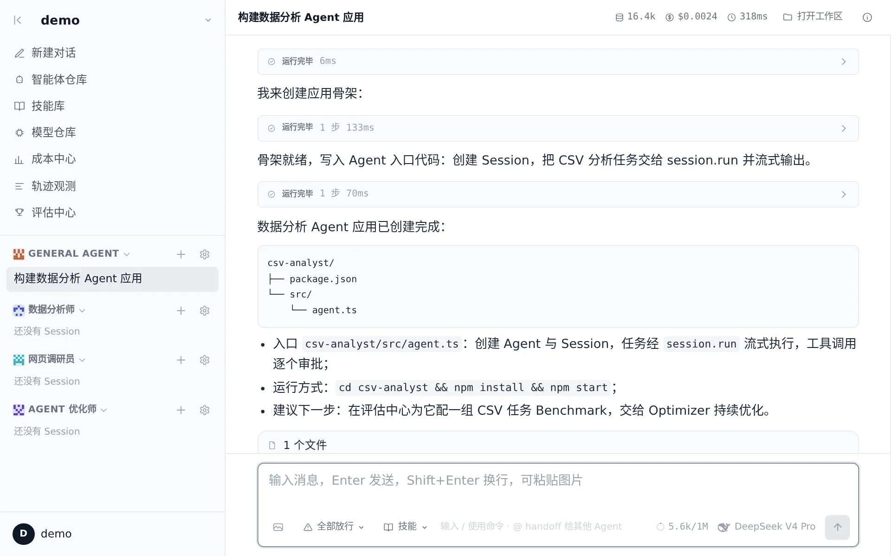
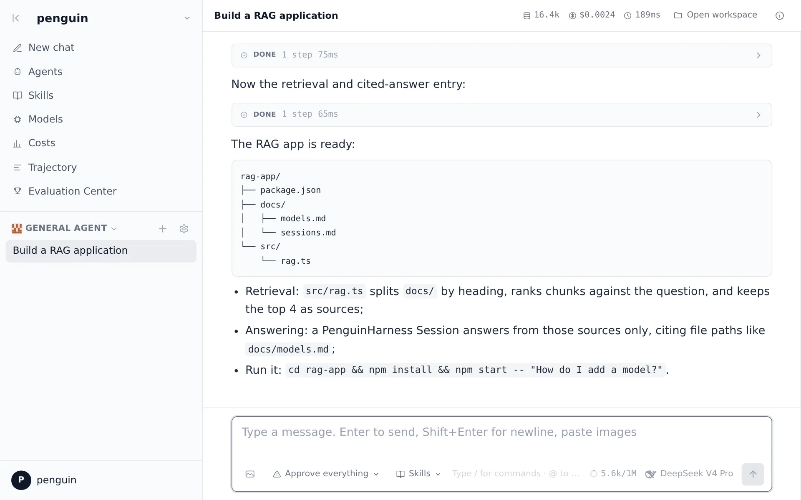

<p align="center">
  
</p>

<h1 align="center">PenguinHarness</h1>

<p align="center"><b>使用 LangChain,以 1 倍速度人工构建 Agent;<br />使用 PenguinHarness,以 100 倍速度用 Agent 构建 Agent。</b></p>

<p align="center">零代码 CLI 与 Web UI,连接 1000+ 模型。</p>

<p align="center">
  <a href="https://github.com/Prism-Shadow/penguin-harness/actions/workflows/ci.yml"></a>
  <a href="https://github.com/Prism-Shadow/penguin-harness/actions/workflows/pages.yml"></a>
  <a href="LICENSE"></a>
  = 24" />
</p>

<p align="center">
  <a href="README.md">English</a> | 简体中文 ·
  <a href="https://penguin.ooo/">官网</a> ·
  <a href="https://penguin.ooo/docs/">文档</a> ·
  <a href="https://penguin.ooo/blog">博客</a>
</p>

<p align="center">
  加入社区:
  <a href="https://discord.gg/eFHKqqcU3D">Discord</a> ·
  <a href="https://x.com/code_hiyouga">X(Twitter)</a> ·
  <a href="https://github.com/Prism-Shadow/penguin-harness-community/blob/main/wechat/group.jpg">微信群</a>
</p>

<p align="center">
  <picture>
    <source media="(prefers-color-scheme: dark)" srcset="packages/landing/src/assets/shots/chat-zh-dark.webp" />
    
  </picture>
</p>

---

## 简单高效

刻意精简的工具集配合干净的底层接口:更少的工具调用、更少的 Token——**Token 用量更好,效果也更好**。同一模型、同一批任务,正面对比:

<p align="center">
  <picture>
    <source media="(prefers-color-scheme: dark)" srcset="assets/readme/benchmark-dark.svg" />
    
  </picture>
</p>

<sub>数据分析:15 题单次运行,美元计价。编程:40 题 × 2 次取均值,官方人民币定价按 $1 = ¥7 折算。完整数据见<a href="https://penguin.ooo/">官网</a>。</sub>

## 一句话构建 Agent

输入一句话,Agent 为你构建完整的 Agent 应用——脚手架、代码、运行说明,一步到位:

```text
Build a RAG app that answers questions over the Markdown files in docs/ with citations.
```

<p align="center">
  <picture>
    <source media="(prefers-color-scheme: dark)" srcset="assets/readme/rag-demo-dark.webp" />
    
  </picture>
</p>

## 自进化

借助 PenguinHarness 技能库,Agent 自己评估、自己优化:跑 Benchmark、找失分点、发布 N+1 版——每轮之前自动快照,每个请求都可在轨迹观测中回放。

<!-- TODO: 自进化演示视频——即将提供。 -->

## 更新日志 · 博客 · 文档

- **更新日志**——按版本归档的更新记录:[`changelog/`](changelog/README.md)。
- **博客**——发布说明与深度文章:[penguin.ooo/blog](https://penguin.ooo/blog)。
- **文档**——使用与设计:[介绍](https://penguin.ooo/docs/) · [快速上手](https://penguin.ooo/docs/quickstart) · [架构](https://penguin.ooo/docs/architecture) · [OmniMessage 协议](https://penguin.ooo/docs/omni-message) · [核心接口](https://penguin.ooo/docs/interfaces) · [Agent 循环](https://penguin.ooo/docs/agent-loop) · [CLI 参考](https://penguin.ooo/docs/cli) · [Server API](https://penguin.ooo/docs/server-api) · [配置](https://penguin.ooo/docs/configuration)。每页都有「复制 Markdown」按钮,可直接粘进模型上下文。

## 支持的模型

| 模型             | 供应商      |
| ---------------- | ----------- |
| DeepSeek V4      | DeepSeek    |
| Kimi K3          | Moonshot AI |
| GLM 5.2          | Z.AI        |
| Hunyuan 3        | 腾讯        |
| Qwen 3.8 Max     | 阿里        |
| GPT 5.5          | OpenAI      |
| Gemini 3.5 Flash | Google      |
| Claude Opus 4.8  | Anthropic   |

模型即 `(provider, model_id)` 二元组加一个 API key:内置供应商分组(DeepSeek、Anthropic、OpenAI、Google Gemini、Z.AI、Moonshot)自动路由,另有 1000+ 在线与本地模型可经 OpenAI 兼容网关(OpenRouter、SiliconFlow 等)或任意自定义端点接入。

## 系统需求与安装

Linux / macOS,x64 / arm64。一行安装器自带 Node 运行时;经 npm 安装需 Node >= 24。至少准备一个模型的 API key。

### Web 应用——面向人

一行安装,启动完整体验(多会话对话、Agent / 技能 / 模型管理、用量统计、轨迹观测、评估中心):

```bash
curl -fsSL https://github.com/Prism-Shadow/penguin-harness/releases/latest/download/install.sh | sh
penguin web        # 启动服务并打开 http://127.0.0.1:7364(首次登录:admin / admin123)
```

或经 npm:`npm install -g @prismshadow/penguin-cli`。在应用内模型页配置模型后即可对话。

### CLI 与 SDK——面向 Agent

同一引擎、可脚本化——为被 Agent 驱动而生(以及让 Agent 构建 Agent):

```bash
penguin config model add --model-id deepseek-v4-pro --api-key sk-... --set-default
penguin run -m "Create hello.txt containing Hello, Penguin"   # 单次任务
penguin chat       # 交互式 REPL(/compact、/exit、Ctrl-C 中断)
penguin server     # 无界面服务(与 Web 应用同一套 API)
```

```ts
import { createAgent, isCompleteModelMessage, userText } from "@prismshadow/penguin-core";

const agent = await createAgent({ agentId: "default_agent" });
const session = await agent.createSession({ workspaceDir: process.cwd() });

for await (const output of session.run([userText("Create hello.txt containing hi")], {
  approve: async () => "allow", // 按工具调用逐个审批
})) {
  if (isCompleteModelMessage(output) && output.payload.type === "text") {
    console.log(output.payload.text);
  }
}
```

## 路线图

- [ ] Benchmark 套件正式发布
- 更多规划,敬请期待……

## 参与开发

```bash
pnpm install && pnpm build   # 先构建:core 的导出指向 dist/
pnpm dev                     # 服务端 + Web 一起启动(带前缀日志,依赖只构建一次)
```

完整工作区指南见 [CONTRIBUTING.md](CONTRIBUTING.md):开发命令、质量门禁、仓库结构与 changelog 规则。

## 引用

如果 PenguinHarness 对你的研究有帮助,请引用:

```bibtex
@software{penguinharness2026,
  author  = {{PrismShadow Team}},
  title   = {PenguinHarness: Efficient Self-Improving Harness for Everyone},
  year    = {2026},
  url     = {https://github.com/Prism-Shadow/penguin-harness},
  license = {Apache-2.0}
}
```

## 协议

[Apache-2.0](LICENSE) © 2026 Prism Shadow

由 LlamaFactory 作者 [Yaowei Zheng](https://github.com/hiyouga)、PrismShadow AI Team 与 Fable 5 共同用 ❤️ 构建。
