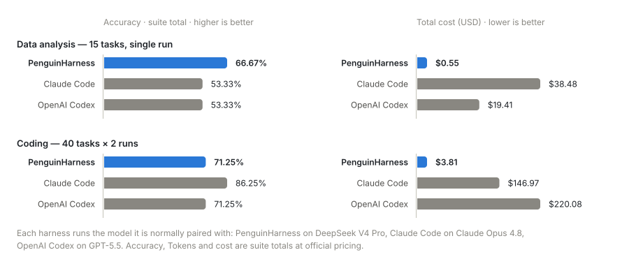

<p align="center">
  
</p>

<h1 align="center">PenguinHarness</h1>

<p align="center"><b>全自动 Agent 构建平台，运行在你的桌面 / 服务器上</b><br />一键创建自进化 Agent</p>

<h3 align="center"><a href="https://penguin.ooo/download/">⬇️ 点击下载</a></h3>

<p align="center">macOS · Windows · Linux</p>

<p align="center">
  <a href="https://www.producthunt.com/products/penguinharness?embed=true&amp;utm_source=badge-featured&amp;utm_medium=badge&amp;utm_campaign=badge-penguinharness" target="_blank" rel="noopener noreferrer"></a>
</p>

<p align="center">
  <a href="https://www.npmjs.com/package/@prismshadow/penguin-core"></a>
  <a href="https://github.com/Prism-Shadow/penguin-harness/actions/workflows/ci.yml"></a>
  <a href="https://github.com/Prism-Shadow/penguin-harness/actions/workflows/pages.yml"></a>
  <a href="LICENSE"></a>
  = 24" />
</p>

<p align="center">
  <a href="https://penguin.ooo/"></a>
  <a href="https://penguin.ooo/docs/"></a>
  <a href="https://penguin.ooo/blog"></a>
</p>

<p align="center">
  <a href="https://discord.gg/eFHKqqcU3D"></a>
  <a href="https://x.com/code_hiyouga"></a>
  <a href="https://github.com/Prism-Shadow/penguin-harness-community/blob/main/wechat/group.jpg"></a>
</p>

<p align="center"><a href="README.md">English</a> | 简体中文</p>

## 为什么选择 PenguinHarness

> 使用 LangChain，以 1 倍速度人工构建 Agent；<br />使用 PenguinHarness，以 100 倍速度用 Agent 构建 Agent。

三个递进的理由——从任务效果，到构建方式，再到进化能力。

### 1. 🏆 以几十分之一的成本，跑出优异的效果

刻意精简的工具集配合干净的底层接口：更少的工具调用、更少的 Token，对 DeepSeek 等开放模型深度适配。各自搭配常用模型、同一批任务，正面对比：

<p align="center">
  <picture>
    <source media="(prefers-color-scheme: dark)" srcset="assets/readme/benchmark-dark.svg" />
    
  </picture>
</p>

**数据分析准确率最高——成本只有 Claude Code 的 1/70。**

### 2. ⚡ 一句话，让 Agent 构建 Agent 应用

输入一句话，Agent 为你构建完整的 Agent 应用——脚手架、代码、运行说明，一步到位：

```text
收集 https://github.com/ericbuess/claude-code-docs 的文档，做一个化身 Claude Code 配置专家、回答带来源引用的 RAG 问答应用。
```

这是做出来的成品——一个文档专家：检索增强、引用可点击直达原文、内置示例问题：

https://github.com/user-attachments/assets/604eb626-0a5d-4a62-87e3-14ebade1cd5f

**而生成整个 RAG 应用，仅消耗了 0.2 元（$0.02）的 token——使用 DeepSeek V4 Pro 模型。**

### 3. 🧬 自进化，越用越强

借助 PenguinHarness 技能库，Agent 自己评估、自己优化：跑 Benchmark、找失分点、发布 N+1 版——每轮之前自动快照，每个请求都可在轨迹观测中回放。

https://github.com/user-attachments/assets/aec49ae9-b743-467b-b247-37bedfeaa36e

## 内置 Skill 库

开箱内置四组 Skill（[文档](https://penguin.ooo/docs/skills)），Agent 也能编写并优化自己的 Skill：

| 分组        | Skill                                                                          |
| ----------- | ------------------------------------------------------------------------------ |
| 办公效率    | `data-analysis`、`firecrawl`                                                   |
| 软件开发    | `web-design`、`software-engineering`                                           |
| AI 应用开发 | `penguin-sdk`、`penguin-cli`、`agenthub-models`、`vllm`、`ollama`、`llamafactory` |
| Agent 调优  | `agent-creation`、`benchmark-design`、`agent-evaluation`、`agent-optimization` |

## 支持的模型

| 模型             | 可用供应商                                                                       |
| ---------------- | -------------------------------------------------------------------------------- |
| DeepSeek V4      | DeepSeek, OpenRouter, Fireworks AI, SiliconFlow, Qwen Token Plan, Qwen Pay-As-You-Go |
| Kimi K3          | Moonshot AI, OpenRouter, Qwen Pay-As-You-Go                                      |
| GLM 5.2          | Z.AI, OpenRouter, Fireworks AI, SiliconFlow, Qwen Token Plan, Qwen Pay-As-You-Go |
| Hunyuan 3        | OpenRouter                                                                       |
| Qwen 3.8 Max     | Qwen Token Plan, Qwen Pay-As-You-Go, OpenRouter                                  |
| GPT 5.6          | OpenRouter                                                                       |
| Gemini 3.6 Flash | Google Gemini, OpenRouter                                                        |
| Claude 5         | Anthropic, OpenRouter                                                            |
| Inkling          | OpenRouter, Fireworks AI                                                         |

上表每个系列只列最新一代，完整预置清单请在应用的**模型**页查看；只要是 OpenAI 协议的端点都可以接入：选择预置，或用自定义端点连接 1000+ 在线与本地模型。

## 系统需求

| 需求项   | 支持情况                                          |
| -------- | ------------------------------------------------- |
| 操作系统 | Linux、macOS、Windows 10+                         |
| 架构     | x64、arm64                                        |
| 运行时   | 一行安装器自带（经 npm 安装需 Node >= 24）        |
| 模型     | 至少一个模型的 API key                            |

## 安装

两条路线——数据同在 `~/.penguin/data` 目录，桌面端与命令行安装可自由混用：

- **🖥️ 桌面端应用**——双击安装：内嵌服务端，打开即已登录，全程无需终端。
- **⌨️ 命令行**——一行命令（或 npm / 离线包）装出 `penguin` 命令，`penguin web` 即在浏览器打开完整 Web 体验 `http://127.0.0.1:7364`（多会话对话、Agent / 技能 / 模型管理、用量统计、轨迹观测、评估中心）。在线安装器自带 Node 运行时，解压即用；升级与重装不触碰数据。

> [!NOTE]
> 命令行安装后，Web 首次登录用户名为 `admin`，初始密码（形如 `penguin-1234`）在改掉之前每次启动服务端都会以边框提示打印，登录后请尽快修改；模型在应用内「模型」页配置。

### 🖥️ 桌面端应用

完整的 Web 体验打包为独立应用：内嵌服务端，打开即已登录——无需终端、无登录页、也不用抄初始密码——并与 CLI 安装共用同一个 `~/.penguin/data` 数据目录，两者可以混用（一个数据目录同一时刻只运行一个服务端；CLI 已启动实例时，应用会直接接入它）。

**[⬇️ 前往下载页获取](https://penguin.ooo/download)**——国内自动走 OSS 镜像加速，安装包也附于每个 [GitHub Release](https://github.com/Prism-Shadow/penguin-harness/releases)。

| 平台          | 安装包                       |
| ------------- | ---------------------------- |
| macOS 11+     | dmg（Apple 芯片 / Intel）    |
| Windows 10+   | 安装程序（.exe，x64）        |
| Linux（x64）  | AppImage / deb               |

当前构建暂未签名，系统可能拦截首次启动。展开对应系统的步骤，操作一次即可解除：

<details>
<summary><b>🍎 macOS 提示「PenguinHarness」已损坏，无法打开？</b></summary>

macOS 会给从网络下载的文件加上隔离标记，应用未签名时会因此被误报「已损坏」。删除该标记即可解除：

1. 打开下载的 dmg，把 `PenguinHarness.app` 拖入「应用程序（Applications）」文件夹。
2. 打开终端：「启动台 → 其他 → 终端」。
3. 在终端粘贴这条命令并回车，然后输入开机密码（输入时屏幕不显示字符，输完回车即可）：

   ```bash
   sudo xattr -rd com.apple.quarantine /Applications/PenguinHarness.app
   ```

4. 执行完成后，双击即可正常打开应用。

</details>

<details>
<summary><b>🪟 Windows SmartScreen 提示「Windows 已保护你的电脑」？</b></summary>

安装程序暂未签名，SmartScreen 会拦截首次运行：点「更多信息」，再点「仍要运行」即可继续安装，仅首次运行需要。

</details>

<details>
<summary><b>🐧 Linux 双击 AppImage 没有反应？</b></summary>

浏览器下载的 AppImage 默认没有执行权限，赋权一次后即可正常启动（deb 包经包管理器安装，无此问题）：

```bash
chmod +x penguin-desktop-linux-x86_64.AppImage
```

</details>

### 🐧🍎 Linux / macOS（在线安装）

```bash
curl -fsSL https://penguin.ooo/install.sh | sh
penguin web        # 启动服务并打开 http://127.0.0.1:7364
```

如需增加完全断网也可使用的文档能力，请安装与平台匹配的离线 profile。它包含 `word-docx`、`powerpoint-pptx` 和 `pdf-tools`，系统需预装带 `venv` 的 CPython 3.9–3.13：

```bash
curl -fsSL https://penguin.ooo/install.sh | sh -s -- --offline
```

### 🪟 Windows（在线安装，PowerShell）

```powershell
irm https://penguin.ooo/install.ps1 | iex
penguin web        # 启动服务并打开 http://127.0.0.1:7364
```

Windows x64 离线 profile 需要显式选择：

```powershell
& ([scriptblock]::Create((irm https://penguin.ooo/install.ps1))) -Offline
```

### 📦 npm（任意平台，需 Node >= 24）

```bash
npm install -g @prismshadow/penguin-cli
penguin web        # 启动服务并打开 http://127.0.0.1:7364
```

<details>
<summary><b>📴 离线安装（无网环境）</b></summary>

每个 <a href="https://github.com/Prism-Shadow/penguin-harness/releases">GitHub Release</a> 会为每个原生目标附带标准安装包——Linux 与 macOS 各有 x64 / arm64，Windows 为 x64——另有不带运行时的 universal 包。每个原生目标还有对应的 `penguin-offline-<target>` 离线 profile，其中包含确定性的 DOCX 检查/编辑、PPTX 检查/追加幻灯片和 PDF 检查/合并 Skill，以及匹配平台的 Python wheels。后续离线 Skill 继续扩展同一 profile。同一个文件同时服务在线与离线安装。包内封入程序负载、其 SHA256 校验文件与对应平台的安装器：在有网机器下载这一个文件，拷贝到目标机器，解压一次并运行包内安装器即可——全程无需联网，也不必另外携带校验文件（包内封入的 SHA256 始终强制校验）。

**Linux（arm64 机器换用 `penguin-linux-arm64.tar.gz`）：**

```bash
mkdir penguin-install
tar -xzf penguin-linux-x64.tar.gz -C penguin-install
./penguin-install/install.sh
```

如需使用离线文档 Skill，同样传输并解压与目标平台匹配的 `penguin-offline-<target>` 包。系统需要预装带 `venv` 的 CPython 3.9–3.13；Linux 要求 glibc 2.17 或更高，不支持 musl/Alpine。每个 Skill 只会从包内共享 wheelhouse 将锁定依赖安装到各自的 Agent 受控环境，不会写入系统 Python。

**macOS（Apple 芯片用 arm64 包，Intel 芯片换用 `penguin-darwin-x64.tar.gz`）：**

```bash
mkdir penguin-install
tar -xzf penguin-darwin-arm64.tar.gz -C penguin-install
./penguin-install/install.sh
```

**Windows（解压后双击 `install.cmd`，或在 PowerShell 中运行）：**

```powershell
Expand-Archive penguin-win32-x64.zip -DestinationPath penguin-install
cd penguin-install
.\install.cmd
```

</details>

### 🤖 CLI 与 SDK——面向 Agent

同一引擎、可脚本化——为被 Agent 驱动而生（以及让 Agent 构建 Agent）：

```bash
penguin config model add --provider deepseek --model-id deepseek-v4-flash --api-key sk-... --set-default
penguin run -m "Create hello.txt containing Hello, Penguin"   # 单次任务
penguin chat       # 交互式 REPL（/compact、/exit、Ctrl-C 中断）
penguin server     # 无界面服务（与 Web 应用同一套 API）
```

```ts
import { createAgent, isCompleteModelMessage, userText } from "@prismshadow/penguin-core";

const agent = await createAgent({ agentId: "default_agent" });
const session = await agent.createSession({ workspaceDir: process.cwd() });

for await (const output of session.run([userText("Create hello.txt containing hi")], {
  approve: async () => "allow", // 按工具调用逐个审批
})) {
  if (isCompleteModelMessage(output) && output.payload.type === "text") {
    console.log(output.payload.text);
  }
}
```

## 路线图

- [ ] Benchmark 套件正式发布
- [x] 桌面端应用
- [x] Windows 系统支持
- [ ] Agent 公司与模板
- [ ] 公司级自进化能力
- [ ] 集成 OpenShell（带权限管控的 shell）
- 更多规划，敬请期待……

## 参与开发

```bash
pnpm install && pnpm build   # 先构建：core 的导出指向 dist/
pnpm dev                     # 服务端 + Web 一起启动（带前缀日志，依赖只构建一次）
```

完整工作区指南见 [CONTRIBUTING.md](CONTRIBUTING.md)：开发命令、质量门禁、仓库结构与 changelog 规则。

## 贡献者

感谢每一位为 PenguinHarness 作出贡献的开发者！

<p align="center">
  <a href="https://github.com/Prism-Shadow/penguin-harness/graphs/contributors"></a>
</p>

## 引用

如果 PenguinHarness 对你的研究有帮助，请引用：

```bibtex
@software{penguinharness2026,
  author  = {{PrismShadow Team}},
  title   = {PenguinHarness: Efficient Self-Improving Harness for Everyone},
  year    = {2026},
  url     = {https://github.com/Prism-Shadow/penguin-harness},
  license = {Apache-2.0}
}
```

## 协议

[Apache-2.0](LICENSE) © 2026 Prism Shadow

由 [LlamaFactory](https://github.com/hiyouga/LlamaFactory) 作者 [Yaowei Zheng](https://github.com/hiyouga)、[PrismShadow AI Team](https://github.com/Prism-Shadow) 与 [Fable 5](https://www.anthropic.com/news/claude-fable-5-mythos-5) 共同用 ❤️ 构建。
