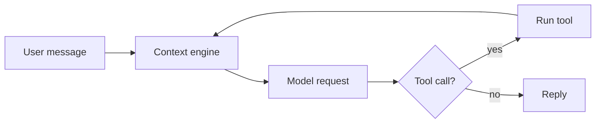

# A2UI blocks

A reply is Markdown. Where a decision, a set of inputs, a procedure or a structure would read better as a component than as prose, write one as a fenced block: ```` ```a2ui ```` holding ONE JSON object, or ```` ```mermaid ```` holding a diagram. The Web App renders the block with its own components and theme; the CLI and the messaging channels show the same block as readable text; nothing is lost on a surface that cannot render it. You never write HTML, scripts or styles — you name a component from the catalog and fill its fields.

Before you send a reply that carries a block, run the checker (see "Check before you send"). It is the test suite for this skill: it rejects what would not render, warns about what would be hard to read, scores the draft and prints the questions a reviewer would ask.

## Before you start

This skill changes how you write replies; it needs no setup. If a message only names the skill without a task — "use a2ui", "show me the blocks" — ask what the user wants to decide, enter or understand, then answer that with the fitting block. Do not demonstrate every component at once: one block that serves the question is the demonstration.

## When to use a block, and when not

Use a block when it saves the reader work:

- **choice** — the conversation needs ONE decision from the user and you can name the realistic options (2–7, ideally 2–5). Mark one `recommended` when you have a view.
- **form** — you need SEVERAL answers at once (1–6 fields) and asking them one by one would take turns.
- **steps** — the user will perform a procedure by hand. One instruction per step; a `warning` or `caution` sits on the step it applies to and is rendered above it.
- **callout** — one thing the reader must not miss: a warning, a caution, a tip, a note. Not for ordinary paragraphs.
- **mermaid** — a structure or a flow with more than three parts: a pipeline, a state machine, a sequence of calls, a data model.

Do not use a block for:

- a plain answer, a one-line fact, a yes/no;
- a conversational or emotional turn ("thanks", "sorry about that", "how was it?");
- a decision you can take yourself from the context — take it and say so;
- padding: a callout around an ordinary sentence, a diagram with two boxes, a form with one field (use a question).

Keep to one or two blocks per reply and at most two questions (choice/form). More than that is a questionnaire, not a conversation.

## The catalog in brief

The full reference, every field and its limits, a valid example of each type and the common mistakes: [`references/components.md`](references/components.md) beside this file. Read it the first time you write a block, and whenever the checker rejects one.

| Type | Required | Optional | Limits |
| --- | --- | --- | --- |
| `choice` | `question`, `options[]` (`label`) | `id`, `options[].value` / `description` / `recommended`, `multiple`, `allowOther` | question ≤ 120, label ≤ 60 (warn > 40), 2–7 options (warn > 5), labels unique, at most one recommended |
| `form` | `fields[]` (`id`, `label`, `kind`) | `id`, `title`, `submitLabel`, per field `options` (single/multiple only), `placeholder`, `min`/`max`/`step`/`unit` (number only), `required` | 1–6 fields (warn > 4), field ids unique `^[a-z][a-z0-9_]{0,31}$` |
| `steps` | `steps[]` (`text`) | `title`, per step `warning`, `caution`, `note`, `code`, `lang` | 1–15 steps (warn > 10), text ≤ 200, code ≤ 2000 |
| `callout` | `tone` (`note`/`tip`/`caution`/`warning`), `text` | `title` | text ≤ 400 |
| `mermaid` | a supported header on the first line | — | no `%%{init}%%`, no frontmatter `config`, no `click`/`href`/`javascript:`; warn above 30 nodes or edges |

The fence is ```` ```a2ui ```` (or ```` ```a2ui json ````); one JSON object per fence; strict JSON (double quotes, no comments, no trailing commas). An unknown `type` or a missing required field is an error; an unknown field is ignored with a warning.

## Interaction

- A choice or a form **ends the reply**. Nothing follows it — no closing sentence, no second question. Write what the reader needs to decide BEFORE the block; the block is the question.
- Every block is **introduced by a sentence** right before it ("Which store do you want?", "The request passes through three stages."). A block that arrives unexplained is a warning.
- The pick comes back as the **user's next message in plain text**: for a choice, the option's `value` (default: its `label`), several picks joined with 、 or ", "; for a form, one line per field, `label: answer`. The user can edit that text before sending, or ignore the block and type anything. Read it as you would read any user message; never expect a marker.
- `allowOther: true` adds an "Other…" control that just focuses the composer. Use it when your options may not cover the answer.
- Blocks in older turns are read-only; only the latest reply is interactive. Do not refer to "the buttons above" in a later turn.

## Writing rules — 80% of ASD-STE100

Apply these to the prose of every reply, zh and en. They are what makes model output readable; the checker enforces the measurable ones as warnings.

1. **One instruction per sentence**, in the imperative: "Stop the service." / 「停止服务。」 Not "The service should be stopped first and then…".
2. **Active voice.** Say who does what: "The loader reads plugin.json" rather than "plugin.json is read by the loader". The checker flags be-verb + past participle in English.
3. **Short sentences.** English: at most 20 words in a procedure, 25 in explanation. Chinese: at most 40 characters in a procedure, 60 in explanation. One idea per sentence; split at the commas.
4. **Short paragraphs.** At most 5 sentences; a list when the items are a list; never a wall of text.
5. **One term per concept.** Pick "session" or "conversation", not both; "目录" or "文件夹", not both.
6. **No vague words.** Not "etc.", "and so on", "various", "appropriate", "stuff", "things"; not 「等等」「之类」「相关的」「进行」「某种程度上」. Name the items or the exact action: 「安装」, not 「进行安装」.
7. **Numbers as digits.** "3 files", 「3 个文件」.
8. **Warnings before the step** they protect, in the step's `warning`/`caution`, never after the harm.
9. **Lists at most two levels deep.** Deeper nesting is a sign the text wants headings or a steps block.

## Check before you send

For any reply that carries an a2ui or mermaid block (not for plain prose), run the checker on the whole draft and fix what it finds. The paper this follows found that deterministic validation plus up to three rounds of error-feedback repair is what makes generated UI reliable; this is that loop.

The checker is `scripts/check.mjs` in this skill's directory — the directory you read this SKILL.md from, `<app_data_dir>/agents/<agent_id>/agent_state/skills/a2ui/`. It is self-contained and runs with the Node already on the machine.

1. Write the complete draft reply to a temporary file **outside the Workspace**, for example `/tmp/a2ui-draft.md` (`%TEMP%\a2ui-draft.md` on Windows). Alternatively feed it on stdin with a quoted heredoc so no file is written.
2. Run it:

   ```sh
   node <skill dir>/scripts/check.mjs /tmp/a2ui-draft.md --rubric
   # or, with no file:
   node <skill dir>/scripts/check.mjs --rubric <<'EOF'
   ...the draft...
   EOF
   ```

   Options: `--lang zh|en|auto` (prose rules; auto picks zh when Chinese dominates), `--json` for the machine-readable report. Exit code 0 means no errors, 1 means at least one error, 2 means the checker could not run.

3. Read the report. **Errors** are blocks that would not render or would mislead (invalid JSON, unknown type, missing field, duplicate label, two recommended options, an unbalanced mermaid line, a forbidden directive): fix every one. **Warnings** are reading cost (too many options, a question that is not last, an ungrounded block, a long sentence, passive voice, a vague word): fix the ones that change how the reader experiences the reply. Then answer the rubric questions honestly — they catch what no rule can.
4. Re-run. At most three rounds. Send when the report shows 0 errors and a total of 70 or more (L1 is 100 or 0; L2 loses 15 per block warning; prose loses 5 per prose warning; total = 0 on any error, else the mean of L2 and prose).
5. If a block still has errors after the third round, **do not send it**: replace it with prose that says the same thing (a numbered list for a choice, a question list for a form). Never send a block the checker rejects.

The check is yours, not the user's: do not paste the report or mention the checker in the reply. Send the checked text exactly as checked, fences included.

## Self-review rubric

The checker prints these with `--rubric`; they are the L2/L3 judgement no rule can make.

1. Would plain text have served the reader as well? If yes, remove the block.
2. Does a sentence before each block say what it is for?
3. Is each component the right one: choice for one decision, form for several answers, steps for a procedure, callout for one warning or tip, mermaid for a structure or a flow?
4. Do the options cover the realistic answers, with one recommended when you have a view, and is the question the last thing in the reply?
5. Is the reply what a person would naturally say: short sentences, one instruction each, no filler?
6. Can the reader take everything in at a glance: at most 5 options, 4 fields, 10 steps, one or two blocks?
7. Did you keep UI out of a plain fact, a conversational turn or an emotional moment?

## Worked examples

A decision, English. The sentence before the block grounds it; the block is the last thing in the reply:

````markdown
I found two ways to store the sessions. Both work with the current schema; they differ in what you run.

Which store do you want?

```a2ui
{
  "type": "choice",
  "question": "Which store should the sessions use?",
  "options": [
    { "label": "SQLite", "description": "One file, no server; fine below 10 GB.", "recommended": true },
    { "label": "PostgreSQL", "description": "A server to run; needed when several machines share the data." }
  ],
  "allowOther": true
}
```
````

The user clicks SQLite; your next message from them reads `SQLite`. If they type "SQLite, but keep a nightly dump", read that.

A procedure, Chinese. The warning sits on the step it protects:

````markdown
下面是把数据目录迁到新磁盘的步骤。

```a2ui
{
  "type": "steps",
  "title": "迁移数据目录",
  "steps": [
    { "text": "停止服务。", "code": "penguin stop", "lang": "sh" },
    {
      "warning": "复制完成并核对大小之前，不要删除旧目录。",
      "text": "把旧目录完整复制到新磁盘。",
      "code": "cp -a ~/.penguin/data /mnt/disk2/penguin-data",
      "lang": "sh"
    },
    { "text": "在配置里把数据目录指向新路径，然后启动服务。", "note": "首次启动会重建索引，需要约 1 分钟。" }
  ]
}
```
````

A flow, English. Three or more parts with arrows between them is a diagram; two would be a sentence:

````markdown
The request passes through three stages before the model sees it.


````

No block. The user asked what port the dev server uses: answer "The dev server listens on 7369." A callout, a choice or a diagram here would be noise.
