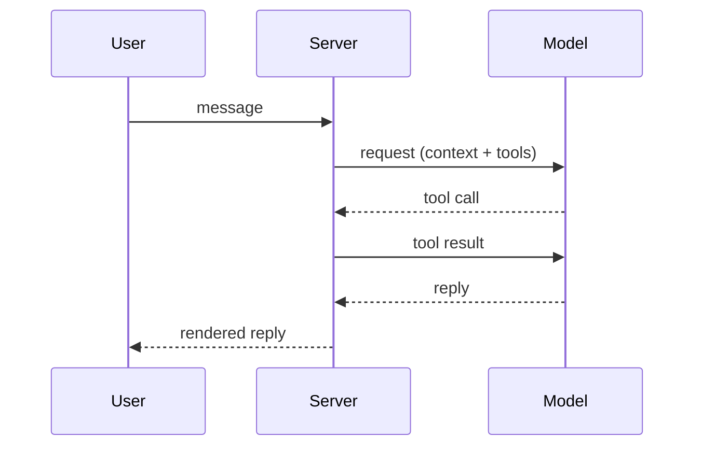
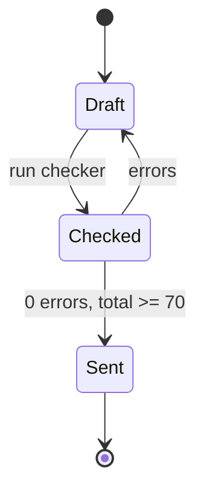

# A2UI component reference

Every component the client can render, field by field, with a valid example and the mistakes the checker rejects. The limits here are the checker's: over a limit is an **error** (the block will not render), past a "warn" mark is a **warning** (the block renders, the reader has more to take in). The grammar lives in `@prismshadow/penguin-core/a2ui`; this file and the checker are generated from the same rules, so what passes here renders.

## The fence

```` ```a2ui ```` (or ```` ```a2ui json ````, or `~~~a2ui`) holding exactly ONE JSON object. Strict JSON: double quotes, no comments, no trailing commas (a trailing comma is tolerated once with a warning). The fence must be closed. An unknown `type` is an error; an unknown field inside a known type is ignored with a warning, so a newer block still renders on an older client.

A fence nested inside a longer fence (four backticks around a `markdown` example) is an example, not a block.

## choice

One question, 2–7 options; the user picks one (or several with `multiple`), the pick fills the composer and the user sends it. A choice ends the reply.

| Field | Type | Rule |
| --- | --- | --- |
| `type` | `"choice"` | required |
| `id` | string | optional, `^[a-z][a-z0-9_-]{0,31}$` |
| `question` | string | required, ≤ 120 characters |
| `options` | array of option | required, 2–7 (warn > 5) |
| `options[].label` | string | required, ≤ 60 (warn > 40), unique within the block |
| `options[].value` | string | optional, ≤ 500; what the pick fills (default: the label) |
| `options[].description` | string | optional, ≤ 160 |
| `options[].recommended` | boolean | optional; at most ONE option may carry `true` |
| `multiple` | boolean | optional; several picks, joined with 、 (zh) or ", " (en) |
| `allowOther` | boolean | optional; adds an "Other…" control that focuses the composer |

```a2ui
{
  "type": "choice",
  "id": "deploy-target",
  "question": "Where should the first deployment go?",
  "options": [
    { "label": "Staging", "value": "Deploy to staging first", "description": "Same config as production, no users.", "recommended": true },
    { "label": "Production", "value": "Deploy straight to production", "description": "Only if the change is already verified." },
    { "label": "Local only", "description": "Build and test here, deploy later." }
  ],
  "allowOther": true
}
```

Fill text when the user picks Staging: `Deploy to staging first`. Use `value` to turn a short label into the sentence you want to read back.

Common mistakes: two options with the same label (`duplicate_label`); `"recommended": true` on two options (`multiple_recommended`); a single option (`count_out_of_range` — ask a plain question instead); eight options (`count_out_of_range` — group them, or ask in two turns); a 70-character label (`too_long` — move the detail into `description`); prose after the block (`interactive_not_last`).

## form

Several questions answered at once, 1–6 fields. The answers fill the composer as one line per field, `label: answer` (en) / `label：answer` (zh), in the form's order; unanswered optional fields produce no line. Required fields must be answered before the fill button enables. A form ends the reply.

| Field | Type | Rule |
| --- | --- | --- |
| `type` | `"form"` | required |
| `id` | string | optional, `^[a-z][a-z0-9_-]{0,31}$` |
| `title` | string | optional, ≤ 80 |
| `fields` | array of field | required, 1–6 (warn > 4) |
| `fields[].id` | string | required, `^[a-z][a-z0-9_]{0,31}$`, unique within the form |
| `fields[].label` | string | required, ≤ 60 |
| `fields[].kind` | `"single"` / `"multiple"` / `"text"` / `"number"` | required |
| `fields[].options` | array of option | required for single/multiple (2–7, same rules as a choice's), not allowed for text/number |
| `fields[].placeholder` | string | optional, ≤ 80; text and number only (ignored elsewhere, with a warning) |
| `fields[].min` / `max` / `step` | number | number only; `min ≤ max`, `step > 0` |
| `fields[].unit` | string | number only, ≤ 12 |
| `fields[].required` | boolean | optional |
| `submitLabel` | string | optional, ≤ 24 |

```a2ui
{
  "type": "form",
  "title": "Benchmark size",
  "fields": [
    { "id": "cases", "label": "Number of cases", "kind": "number", "min": 5, "max": 100, "step": 5, "required": true },
    { "id": "budget", "label": "Budget per run", "kind": "number", "min": 1, "unit": "USD", "placeholder": "10" },
    {
      "id": "focus",
      "label": "What matters most",
      "kind": "single",
      "options": [{ "label": "Accuracy" }, { "label": "Speed" }, { "label": "Cost" }],
      "required": true
    },
    { "id": "notes", "label": "Anything else", "kind": "text", "placeholder": "Constraints, deadlines" }
  ],
  "submitLabel": "Use these"
}
```

Fill text for `cases` 20, `budget` 5, `focus` Speed:

```text
Number of cases: 20
Budget per run: 5 USD
What matters most: Speed
```

Common mistakes: `options` on a `text` field (`options_forbidden`); a `single` field without `options` (`options_required`); `min`/`max`/`unit` on a `text` field (`number_only`); `min` greater than `max` (`range_invalid`); two fields with the same `id` (`duplicate_id`); an `id` with a hyphen or a capital (`invalid_format`); seven fields (`count_out_of_range` — split into two turns).

## steps

A procedure the user performs, 1–15 steps, one instruction per step. A `warning` (irreversible loss, security, harm) or a `caution` (something recoverable breaks) is rendered ABOVE its step, as STE requires; a `note` (useful information) below it. `code` is one command or snippet for that step.

| Field | Type | Rule |
| --- | --- | --- |
| `type` | `"steps"` | required |
| `title` | string | optional, ≤ 80 |
| `steps` | array of step | required, 1–15 (warn > 10) |
| `steps[].text` | string | required, ≤ 200; the instruction, imperative |
| `steps[].warning` | string | optional, ≤ 200 |
| `steps[].caution` | string | optional, ≤ 200 |
| `steps[].note` | string | optional, ≤ 200 |
| `steps[].code` | string | optional, ≤ 2000 |
| `steps[].lang` | string | optional, ≤ 20; only with `code` |

```a2ui
{
  "type": "steps",
  "title": "Rotate the API key",
  "steps": [
    { "text": "Create the new key in the provider console and copy it." },
    {
      "caution": "Running sessions keep the old key until they restart.",
      "text": "Store the new key in the Vault under the same name.",
      "code": "penguin config set-key openai sk-...",
      "lang": "sh"
    },
    { "text": "Send one test request and confirm it succeeds.", "code": "penguin models test openai", "lang": "sh" },
    {
      "warning": "Deleting the old key logs out every client that still uses it.",
      "text": "Delete the old key in the provider console.",
      "note": "Keep the console open for 10 minutes in case a client still fails."
    }
  ]
}
```

Common mistakes: two instructions in one `text` ("Stop the service and delete the directory" — two steps); a warning written after the harmful step (put it in that step's `warning`); a `lang` without `code` (`ignored_field`); 20 steps (`count_out_of_range` — split the procedure).

## callout

One thing the reader must not miss. Four tones, each with a fixed meaning: `warning` for irreversible loss, security or harm; `caution` for something recoverable that may break; `tip` for a better way; `note` for information worth setting apart. Not a replacement for an ordinary paragraph.

| Field | Type | Rule |
| --- | --- | --- |
| `type` | `"callout"` | required |
| `tone` | `"note"` / `"tip"` / `"caution"` / `"warning"` | required |
| `title` | string | optional, ≤ 80 |
| `text` | string | required, ≤ 400 |

```a2ui
{
  "type": "callout",
  "tone": "warning",
  "title": "This deletes data",
  "text": "The reset removes every Session under this Project. Export the Traces you want to keep before you continue."
}
```

Common mistakes: a tone outside the four (`invalid_enum`); a 600-character text (`too_long` — a callout is one point, not a section); a callout around an ordinary sentence (the rubric's first question).

## mermaid

A ```` ```mermaid ```` fence, not JSON. The first non-comment line names the diagram: one of `flowchart`, `graph`, `sequenceDiagram`, `stateDiagram`, `stateDiagram-v2`, `classDiagram`, `erDiagram`, `gantt`, `journey`, `pie`, `mindmap`, `timeline`, `gitGraph`, `quadrantChart`, `xychart-beta`, `requirementDiagram`, `C4Context`. The app sets the theme and the security level; the diagram carries no configuration:

- no `%%{init: …}%%` directive and no YAML frontmatter key other than `title` (`mermaid_directive`);
- no `click`, `link`, `callback`, `href`, `javascript:` or `<script` (`mermaid_forbidden`) — describe the target in the prose;
- brackets and quotes balanced on every line of a flowchart, state, class or ER diagram (`mermaid_unbalanced`): a label with parentheses or brackets must be quoted, `A["Run (dry)"]`;
- more than 30 nodes or edges, or 400 lines, is a warning (`mermaid_too_big`): split it, or show the main path only.





## What a surface without a renderer shows

The CLI and the messaging channels replace each valid block with Markdown: a choice becomes the bold question, a numbered list (`1. label — description (recommended)`) and "Reply with a number or your own answer." / 「回复编号或直接写出你的答案。」; a form becomes its title and one bullet per field with the options inline; steps become a numbered list with **WARNING:** / **CAUTION:** lines above the step and **NOTE:** below it (「警告：」「注意：」「说明：」), code as a fence; a callout becomes a blockquote with a bold tone label. A mermaid fence stays a fence. An invalid block stays as you wrote it, so write every block as if it will be read as text.

## The checker's codes

Errors (L1 — the block does not render; total score 0):

| Code | Meaning |
| --- | --- |
| `unclosed_fence` | the fence has no closing line |
| `empty_block`, `invalid_json`, `not_object` | the body is empty, not JSON, or not one object |
| `missing_type`, `unknown_type` | no `type`, or a type outside the catalog |
| `missing_field`, `empty_string`, `wrong_type`, `invalid_enum`, `invalid_format` | a required field absent or blank, the wrong JSON type, a value outside an enum or a pattern |
| `too_long`, `count_out_of_range` | a string over its limit; an array outside its range |
| `duplicate_label`, `duplicate_id`, `multiple_recommended` | reference integrity inside the block |
| `options_required`, `options_forbidden`, `number_only`, `range_invalid` | field rules of a form |
| `mermaid_empty`, `mermaid_unknown_type`, `mermaid_directive`, `mermaid_forbidden`, `mermaid_unbalanced` | the mermaid rules above |

Warnings (L2 — 15 points each off the L2 score):

| Code | Meaning |
| --- | --- |
| `unknown_field`, `ignored_field`, `json_trailing_comma` | tolerated, but not what the catalog says |
| `too_many_options`, `form_too_many_fields`, `steps_too_many`, `option_label_long`, `mermaid_too_big` | past the "warn" marks |
| `ui_overuse` | more than 2 interactive blocks, or more than 4 blocks, in one reply |
| `interactive_not_last` | something follows a choice or a form |
| `ungrounded_block` | no sentence introduces the block |

Warnings (prose — 5 points each off the prose score): `long_sentence` (en > 25 words, zh > 60 characters), `long_paragraph` (> 5 sentences), `wall_of_text` (> 800 characters with no break), `passive_voice` (en), `vague_word`, `deep_nesting` (lists deeper than 2 levels). Code, fences, tables, URLs and headings are not linted.

Score: L1 is 100 with no error, else 0. L2 = 100 − 15 × block warnings, prose = 100 − 5 × prose warnings, both floored at 0. Total = 0 on any error, else round(0.5 × L2 + 0.5 × prose). Send at 0 errors and total ≥ 70.
