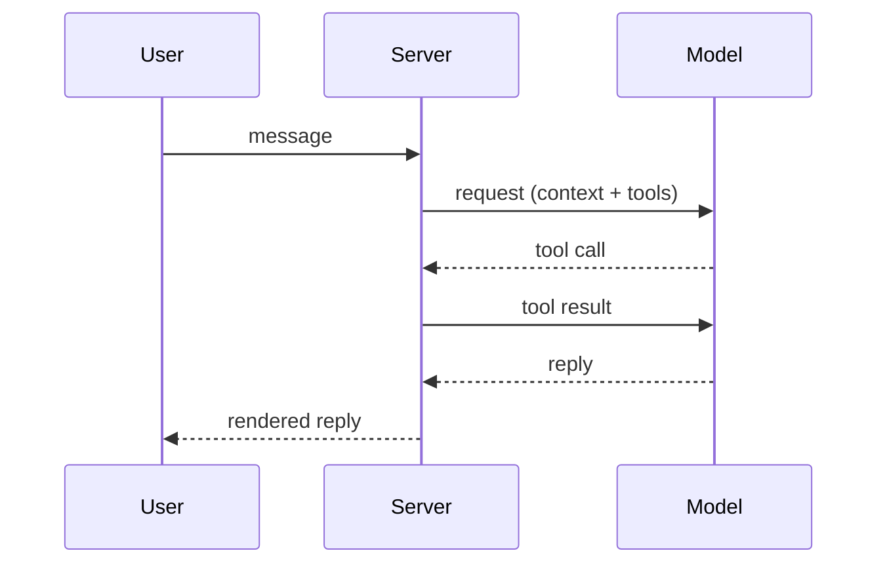
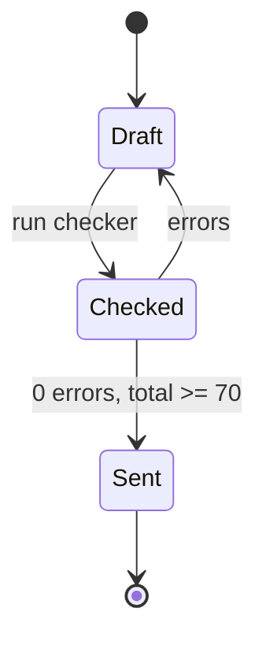

# A2UI component reference

Every component the client can render, field by field, with a valid example and the mistakes the checker rejects. The limits here are the checker's: over a limit is an **error** (the block will not render), past a "warn" mark is a **warning** (the block renders, the reader has more to take in). The grammar lives in `@prismshadow/penguin-core/a2ui`; this file and the checker are generated from the same rules, so what passes here renders.

## The fence

```` ```a2ui ```` (or ```` ```a2ui json ````, or `~~~a2ui`) holding exactly ONE JSON object. Strict JSON: double quotes, no comments, no trailing commas (a trailing comma is tolerated once with a warning). The fence must be closed. An unknown `type` is an error; an unknown field inside a known type is ignored with a warning, so a newer block still renders on an older client.

A fence nested inside a longer fence (four backticks around a `markdown` example) is an example, not a block.

## choice

One question, 2–7 options; the user picks one (or several with `multiple`), the pick fills the composer and the user sends it. A choice ends the reply.

| Field | Type | Rule |
| --- | --- | --- |
| `type` | `"choice"` | required |
| `id` | string | optional, `^[a-z][a-z0-9_-]{0,31}$` |
| `question` | string | required, ≤ 120 characters |
| `options` | array of option | required, 2–7 (warn > 5) |
| `options[].label` | string | required, ≤ 60 (warn > 40), unique within the block |
| `options[].value` | string | optional, ≤ 500; what the pick fills (default: the label) |
| `options[].description` | string | optional, ≤ 160 |
| `options[].recommended` | boolean | optional; at most ONE option may carry `true` |
| `multiple` | boolean | optional; several picks, joined with 、 (zh) or ", " (en) |
| `allowOther` | boolean | optional; adds an "Other…" control that clears the composer and focuses it |

```a2ui
{
  "type": "choice",
  "id": "deploy-target",
  "question": "Where should the first deployment go?",
  "options": [
    { "label": "Staging", "value": "Deploy to staging first", "description": "Same config as production, no users.", "recommended": true },
    { "label": "Production", "value": "Deploy straight to production", "description": "Only if the change is already verified." },
    { "label": "Local only", "description": "Build and test here, deploy later." }
  ],
  "allowOther": true
}
```

Fill text when the user picks Staging: `Deploy to staging first`. Use `value` to turn a short label into the sentence you want to read back.

Common mistakes: two options with the same label (`duplicate_label`); `"recommended": true` on two options (`multiple_recommended`); a single option (`count_out_of_range` — ask a plain question instead); eight options (`count_out_of_range` — group them, or ask in two turns); a 70-character label (`too_long` — move the detail into `description`); prose after the block (`interactive_not_last`).

## form

Several questions answered at once, 1–6 fields. The answers fill the composer as one line per field, `label: answer` (en) / `label：answer` (zh), in the form's order; unanswered optional fields produce no line. Required fields must be answered before the fill button enables. A form ends the reply.

| Field | Type | Rule |
| --- | --- | --- |
| `type` | `"form"` | required |
| `id` | string | optional, `^[a-z][a-z0-9_-]{0,31}$` |
| `title` | string | optional, ≤ 80 |
| `fields` | array of field | required, 1–6 (warn > 4) |
| `fields[].id` | string | required, `^[a-z][a-z0-9_]{0,31}$`, unique within the form |
| `fields[].label` | string | required, ≤ 60 |
| `fields[].kind` | `"single"` / `"multiple"` / `"text"` / `"number"` | required |
| `fields[].options` | array of option | required for single/multiple (2–7, same rules as a choice's), not allowed for text/number |
| `fields[].placeholder` | string | optional, ≤ 80; text and number only (ignored elsewhere, with a warning) |
| `fields[].min` / `max` / `step` | number | number only; `min ≤ max`, `step > 0` |
| `fields[].unit` | string | number only, ≤ 12 |
| `fields[].required` | boolean | optional |
| `submitLabel` | string | optional, ≤ 24 |

```a2ui
{
  "type": "form",
  "title": "Benchmark size",
  "fields": [
    { "id": "cases", "label": "Number of cases", "kind": "number", "min": 5, "max": 100, "step": 5, "required": true },
    { "id": "budget", "label": "Budget per run", "kind": "number", "min": 1, "unit": "USD", "placeholder": "10" },
    {
      "id": "focus",
      "label": "What matters most",
      "kind": "single",
      "options": [{ "label": "Accuracy" }, { "label": "Speed" }, { "label": "Cost" }],
      "required": true
    },
    { "id": "notes", "label": "Anything else", "kind": "text", "placeholder": "Constraints, deadlines" }
  ],
  "submitLabel": "Use these"
}
```

Fill text for `cases` 20, `budget` 5, `focus` Speed:

```text
Number of cases: 20
Budget per run: 5 USD
What matters most: Speed
```

Common mistakes: `options` on a `text` field (`options_forbidden`); a `single` field without `options` (`options_required`); `min`/`max`/`unit` on a `text` field (`number_only`); `min` greater than `max` (`range_invalid`); two fields with the same `id` (`duplicate_id`); an `id` with a hyphen or a capital (`invalid_format`); seven fields (`count_out_of_range` — split into two turns).

## steps

A procedure the user performs, 1–15 steps, one instruction per step. A `warning` (irreversible loss, security, harm) or a `caution` (something recoverable breaks) is rendered ABOVE its step, as STE requires; a `note` (useful information) below it. `code` is one command or snippet for that step.

| Field | Type | Rule |
| --- | --- | --- |
| `type` | `"steps"` | required |
| `title` | string | optional, ≤ 80 |
| `steps` | array of step | required, 1–15 (warn > 10) |
| `steps[].text` | string | required, ≤ 200; the instruction, imperative |
| `steps[].warning` | string | optional, ≤ 200 |
| `steps[].caution` | string | optional, ≤ 200 |
| `steps[].note` | string | optional, ≤ 200 |
| `steps[].code` | string | optional, ≤ 2000 |
| `steps[].lang` | string | optional, ≤ 20; only with `code` |

```a2ui
{
  "type": "steps",
  "title": "Rotate the API key",
  "steps": [
    { "text": "Create the new key in the provider console and copy it." },
    {
      "caution": "Running sessions keep the old key until they restart.",
      "text": "Store the new key in the Vault under the same name.",
      "code": "penguin config set-key openai sk-...",
      "lang": "sh"
    },
    { "text": "Send one test request and confirm it succeeds.", "code": "penguin models test openai", "lang": "sh" },
    {
      "warning": "Deleting the old key logs out every client that still uses it.",
      "text": "Delete the old key in the provider console.",
      "note": "Keep the console open for 10 minutes in case a client still fails."
    }
  ]
}
```

Common mistakes: two instructions in one `text` ("Stop the service and delete the directory" — two steps); a warning written after the harmful step (put it in that step's `warning`); a `lang` without `code` (`ignored_field`); 20 steps (`count_out_of_range` — split the procedure).

## callout

One thing the reader must not miss. Four tones, each with a fixed meaning: `warning` for irreversible loss, security or harm; `caution` for something recoverable that may break; `tip` for a better way; `note` for information worth setting apart. Not a replacement for an ordinary paragraph.

| Field | Type | Rule |
| --- | --- | --- |
| `type` | `"callout"` | required |
| `tone` | `"note"` / `"tip"` / `"caution"` / `"warning"` | required |
| `title` | string | optional, ≤ 80 |
| `text` | string | required, ≤ 400 |

```a2ui
{
  "type": "callout",
  "tone": "warning",
  "title": "This deletes data",
  "text": "The reset removes every Session under this Project. Export the Traces you want to keep before you continue."
}
```

Common mistakes: a tone outside the four (`invalid_enum`); a 600-character text (`too_long` — a callout is one point, not a section); a callout around an ordinary sentence (the rubric's first question).

## mermaid

A ```` ```mermaid ```` fence, not JSON. The first non-comment line names the diagram: one of `flowchart`, `graph`, `sequenceDiagram`, `stateDiagram`, `stateDiagram-v2`, `classDiagram`, `erDiagram`, `gantt`, `journey`, `pie`, `mindmap`, `timeline`, `gitGraph`, `quadrantChart`, `xychart-beta`, `requirementDiagram`, `C4Context`. The app sets the theme and the security level; the diagram carries no configuration:

- no `%%{init: …}%%` directive and no YAML frontmatter key other than `title` (`mermaid_directive`);
- no `click`, `link`, `callback`, `href`, `javascript:` or `<script` (`mermaid_forbidden`) — describe the target in the prose;
- brackets and quotes balanced on every line of a flowchart, state, class or ER diagram (`mermaid_unbalanced`): a label with parentheses or brackets must be quoted, `A["Run (dry)"]`;
- more than 30 nodes or edges, or 400 lines, is a warning (`mermaid_too_big`): split it, or show the main path only.





## weather

The conditions at one place now, optionally with the next hours and the coming days. A snapshot: it shows the time in `asOf` and never updates. The Web App draws a line illustration of the condition that moves (rain falls, clouds drift) and stays still under reduced motion. Take the data from `scripts/weather.mjs`, never from memory. The script reads Open-Meteo and falls back to wttr.in when Open-Meteo fails; `source` names the one that answered.

| Field | Type | Rule |
| --- | --- | --- |
| `type` | `"weather"` | required |
| `place` | string | required, ≤ 60 |
| `condition` | condition | required; one of `clear`, `partly-cloudy`, `cloudy`, `fog`, `drizzle`, `rain`, `heavy-rain`, `thunder`, `snow`, `sleet`, `wind` |
| `temp` | number | required |
| `unit` | `"C"` / `"F"` | optional, default `"C"`; applies to every temperature in the block |
| `night` | boolean | optional; draws the moon for `clear` and `partly-cloudy` |
| `summary` | string | optional, ≤ 80; one line in your words |
| `high` / `low` | number | optional; `high ≥ low` |
| `feelsLike` | number | optional |
| `humidity` | number | optional, 0–100 |
| `windSpeed` | number | optional, ≥ 0 |
| `windUnit` | `"km/h"` / `"m/s"` / `"mph"` | optional, default `"km/h"`; only with `windSpeed` |
| `windDirection` | string | optional, ≤ 6 (`"NE"`, `"东北"`); only with `windSpeed` |
| `hourly` | array of hour | optional, 2–24 (warn > 12) |
| `hourly[].time` | string | required, `"HH:mm"` (24 h) or an ISO date-time |
| `hourly[].temp` | number | required |
| `hourly[].condition` | condition | optional |
| `hourly[].precip` | number | optional, chance of precipitation 0–100 |
| `hourly[].night` | boolean | optional; the night drawing for that hour |
| `daily` | array of day | optional, 2–7 |
| `daily[].date` | string | required, `"YYYY-MM-DD"` |
| `daily[].high` / `low` | number | required; `high ≥ low` |
| `daily[].condition` | condition | required |
| `daily[].precip` | number | optional, 0–100 |
| `asOf` | string | optional, an ISO 8601 date-time; without it the checker warns (`no_as_of`) |
| `source` | string | optional, ≤ 40, e.g. `"Open-Meteo"` or `"wttr.in"` |

```a2ui
{
  "type": "weather",
  "place": "Beijing",
  "condition": "partly-cloudy",
  "temp": 18,
  "unit": "C",
  "high": 22,
  "low": 12,
  "feelsLike": 17,
  "humidity": 62,
  "windSpeed": 12,
  "windUnit": "km/h",
  "windDirection": "NE",
  "hourly": [
    { "time": "14:00", "temp": 18, "condition": "partly-cloudy", "precip": 10 },
    { "time": "15:00", "temp": 19, "condition": "partly-cloudy", "precip": 10 },
    { "time": "16:00", "temp": 19, "condition": "cloudy", "precip": 20 },
    { "time": "17:00", "temp": 18, "condition": "cloudy", "precip": 20 }
  ],
  "daily": [
    { "date": "2026-10-06", "high": 22, "low": 12, "condition": "partly-cloudy", "precip": 20 },
    { "date": "2026-10-07", "high": 19, "low": 11, "condition": "rain", "precip": 80 }
  ],
  "asOf": "2026-10-06T14:05+08:00",
  "source": "Open-Meteo"
}
```

As text, made the same afternoon in Beijing time:

```text
**Beijing · Partly cloudy 18°C**

H 22° / L 12° · Feels like 17° · Humidity 62% · Wind 12 km/h NE

Next hours: 14:00 18° · 15:00 19° · 16:00 19° · 17:00 18°

Next days:
- Today Partly cloudy 22° / 12° · 20%
- Wed Rain 19° / 11° · 80%

As of 14:05 · Source: Open-Meteo
```

Common mistakes: a forecast written from memory (the rubric's eighth question; run the script); no `asOf` (`no_as_of`) or one that does not parse (`invalid_datetime`); `"time": "2pm"` (`invalid_format`; write `"14:00"`); `"condition": "sunny"` (`invalid_enum`; write `"clear"`); `high` below `low` (`range_invalid`); `"humidity": 120` (`range_invalid`); `windDirection` without `windSpeed` (`ignored_field`); 24 hourly entries (`weather_hourly_long`; the script keeps every second hour past 12).

## clock

The time now, in one to four time zones. Live: the Web App ticks it every second, so the block carries no time at all, only the zones.

| Field | Type | Rule |
| --- | --- | --- |
| `type` | `"clock"` | required |
| `title` | string | optional, ≤ 40 |
| `zones` | array of zone | optional, 1–4; default: the viewer's local time |
| `zones[].zone` | string | required, ≤ 64; an IANA name (`"Asia/Shanghai"`, `"America/New_York"`) or `"local"` |
| `zones[].label` | string | optional, ≤ 24 (`"Beijing"`, `"北京"`) |
| `style` | `"digital"` / `"analog"` / `"both"` | optional, default `"digital"` |
| `hourCycle` | `"12"` / `"24"` / `"auto"` | optional, default `"auto"` (the interface language decides) |
| `seconds` | boolean | optional, default false; the digital time shows seconds |
| `date` | boolean | optional, default true; the weekday and the date under the time |

```a2ui
{
  "type": "clock",
  "title": "Stand-up at 09:30 Beijing time",
  "zones": [
    { "zone": "Asia/Shanghai", "label": "Beijing" },
    { "zone": "Europe/London", "label": "London" },
    { "zone": "America/New_York", "label": "New York" }
  ],
  "hourCycle": "24"
}
```

As text, one line per zone with the time at which the text was made:

```text
**Stand-up at 09:30 Beijing time**

- Beijing: 14:05 (Tue, Asia/Shanghai)
- London: 07:05 (Tue, Europe/London)
- New York: 02:05 (Tue, America/New_York)
```

Common mistakes: a city or a time zone's common name as `zone` (`"Beijing"`, `"China Standard Time"`: `invalid_timezone`; write `"Asia/Shanghai"`); the same zone twice (`duplicate_zone`); five zones (`count_out_of_range`); the current time written into `title` (it is wrong a minute later; the clock already shows it).

## countdown

The time left until one instant. Live: the Web App counts down every second and shows `doneLabel` once the instant passes.

| Field | Type | Rule |
| --- | --- | --- |
| `type` | `"countdown"` | required |
| `to` | string | required; an ISO 8601 date-time (`"2026-10-09T18:00+08:00"`) or `"YYYY-MM-DD"` (midnight, the viewer's local time) |
| `label` | string | required, ≤ 60; what happens then |
| `doneLabel` | string | optional, ≤ 60; shown once the instant passes (default: "Time's up") |
| `showTarget` | boolean | optional, default true; the target date and time under the figure |

Write the offset in `to` when the instant belongs to a place: "18:00 Beijing time" is `+08:00`. Without an offset, every viewer counts down to 18:00 on their own clock.

```a2ui
{
  "type": "countdown",
  "to": "2026-10-09T18:00+08:00",
  "label": "Launch deadline",
  "doneLabel": "Launch window open"
}
```

As text, made at 14:05 Beijing time on 2026-10-06: `**Launch deadline**: 3 days 3 hours left (2026-10-09 18:00)`; once the instant has passed, `**Launch deadline**: Launch window open (2026-10-09 18:00)`.

Common mistakes: `"to": "next Friday"` or `"2026/10/09"` (`invalid_datetime`); a label that says when instead of what (`"Oct 9"`; the target is shown already); a countdown to an instant that has passed (say it in prose).

## metrics

A snapshot of one to eight readings, one tile each. The same block serves a system snapshot, a quota or budget left and the progress of a job: `kind` says how to read each tile. Put the readings of one moment in one block, never one block per number.

| Field | Type | Rule |
| --- | --- | --- |
| `type` | `"metrics"` | required |
| `title` | string | optional, ≤ 40 |
| `items` | array of metric | required, 1–8 (warn > 6) |
| `asOf` | string | optional, an ISO 8601 date-time; without it the checker warns (`no_as_of`) |
| `items[].label` | string | required, ≤ 40, unique within the block |
| `items[].value` | number | required |
| `items[].kind` | `"reading"` / `"used"` / `"remaining"` / `"progress"` | optional, default `"reading"` |
| `items[].max` | number | the whole; required for `used`, `remaining` and `progress`, and for a `ring` or `bar` gauge |
| `items[].min` | number | optional, default 0; `min < max` |
| `items[].gauge` | `"ring"` / `"bar"` / `"none"` | optional; default `bar` for `progress`, `ring` when `max` is given, else `none` |
| `items[].unit` | string | optional, ≤ 12, after the number (`"%"`, `"GB"`, `"ms"`) |
| `items[].prefix` | string | optional, ≤ 4, before the number (`"¥"`, `"$"`) |
| `items[].decimals` | integer | optional, 0–3; default 0 for a whole number, else up to 2 |
| `items[].worse` | `"high"` / `"low"` | optional, which way is bad; default `low` for `remaining`, else `high` |
| `items[].warn` / `danger` | number | optional, in the value's unit, read along `worse` |
| `items[].detail` | string | optional, ≤ 60; one quiet line under the value (default from `kind`, e.g. "320 / 512 GB used") |
| `items[].delta` | number | optional; the change since the previous reading, in the same unit |
| `items[].deltaLabel` | string | optional, ≤ 24 (`"vs. yesterday"`); only with `delta` |
| `items[].history` | array of number | optional, 2–60 points, oldest first; draws a sparkline |

The four kinds:

- `reading` — a measurement: CPU 37 %, load 1.2, latency 120 ms.
- `used` — the part of a whole already consumed: disk 320 of 512 GB.
- `remaining` — the part of a whole still left: a quota of 1,240 of 5,000, a budget of ¥320 of ¥1,000.
- `progress` — how far a job got: upload 63 %, 7 of 12 tasks. At `value ≥ max` the tile shows done.

Thresholds: past `warn` the tile takes the attention colour, past `danger` the danger colour. With `worse: "high"` (the default) they read upward, so `warn ≤ danger`: CPU `warn: 80, danger: 95`. With `worse: "low"` they read downward, so `warn ≥ danger`: `warn: 1000, danger: 250` on a 5,000 quota.

```a2ui
{
  "type": "metrics",
  "title": "build-01",
  "items": [
    { "label": "CPU", "value": 37, "max": 100, "unit": "%", "warn": 80, "danger": 95, "history": [22, 31, 45, 40, 37] },
    { "label": "Memory", "kind": "used", "value": 13.9, "max": 16, "unit": "GB", "decimals": 1, "warn": 13.6, "danger": 15.2, "delta": 0.4, "deltaLabel": "vs. yesterday" },
    { "label": "API quota", "kind": "remaining", "value": 1240, "max": 5000, "warn": 1000, "danger": 250, "detail": "Resets in 3 days" },
    { "label": "Upload", "kind": "progress", "value": 63, "max": 100, "unit": "%" }
  ],
  "asOf": "2026-10-06T14:05+08:00"
}
```

As text, the title, one bullet per tile and the `asOf` time. The memory tile reads `- Memory: 13.9 GB — 13.9 / 16 GB used (+0.4 GB vs. yesterday) — warning`: its value, the detail, the change, and a mark for the colour (warning, critical or done).

Common mistakes: `"kind": "remaining"` or `"gauge": "ring"` without `max` (`missing_field`); thresholds against `worse`, such as `warn: 250, danger: 1000` on a `remaining` tile (`range_invalid`; swap them, or set `worse`); `min` not below `max` (`range_invalid`); `"decimals": 5` (`range_invalid`); two tiles with one label (`duplicate_label`); `deltaLabel` without `delta` (`ignored_field`); seven tiles (`metrics_too_many`) or nine (`count_out_of_range`); numbers from memory or an estimate (the rubric's eighth question).

## What a surface without a renderer shows

The CLI and the messaging channels replace each valid block with Markdown: a choice becomes the bold question, a numbered list (`1. label — description (recommended)`) and "Reply with a number or your own answer." / 「回复编号或直接写出你的答案。」; a form becomes its title and one bullet per field with the options inline; steps become a numbered list with **WARNING:** / **CAUTION:** lines above the step and **NOTE:** below it (「警告：」「注意：」「说明：」), code as a fence; a callout becomes a blockquote with a bold tone label. A widget becomes its readings as text: weather a bold headline over its details, hours and days; a clock one line per zone with the time when the text was made; a countdown the time left, or "reached" once past; metrics one bullet per tile. Weather and metrics end with their time, "As of 14:05" / 「数据时间 14:05」. A mermaid fence stays a fence. An invalid block stays as you wrote it, so write every block as if it will be read as text.

## The checker's codes

Errors (L1 — the block does not render; total score 0):

| Code | Meaning |
| --- | --- |
| `unclosed_fence` | the fence has no closing line |
| `empty_block`, `invalid_json`, `not_object` | the body is empty, not JSON, or not one object |
| `missing_type`, `unknown_type` | no `type`, or a type outside the catalog |
| `missing_field`, `empty_string`, `wrong_type`, `invalid_enum`, `invalid_format` | a required field absent or blank, the wrong JSON type, a value outside an enum or a pattern |
| `too_long`, `count_out_of_range` | a string over its limit; an array outside its range |
| `duplicate_label`, `duplicate_id`, `multiple_recommended`, `duplicate_zone` | reference integrity inside the block |
| `options_required`, `options_forbidden`, `number_only` | field rules of a form |
| `range_invalid` | a number outside its range or two numbers in the wrong order: a form's `min` above `max`, `high` below `low`, a humidity over 100, metric thresholds against `worse` |
| `invalid_datetime`, `invalid_timezone` | an `asOf` or `to` that does not parse; a `zone` that is neither an IANA name nor `local` |
| `mermaid_empty`, `mermaid_unknown_type`, `mermaid_directive`, `mermaid_forbidden`, `mermaid_unbalanced` | the mermaid rules above |

Warnings (L2 — 15 points each off the L2 score):

| Code | Meaning |
| --- | --- |
| `unknown_field`, `ignored_field`, `json_trailing_comma` | tolerated, but not what the catalog says |
| `too_many_options`, `form_too_many_fields`, `steps_too_many`, `option_label_long`, `weather_hourly_long`, `metrics_too_many`, `mermaid_too_big` | past the "warn" marks |
| `no_as_of` | a weather or metrics block without `asOf` |
| `ui_overuse` | more than 2 interactive blocks, or more than 4 blocks, in one reply |
| `interactive_not_last` | something follows a choice or a form (a widget may be followed by prose) |
| `ungrounded_block` | no sentence introduces the block |

Warnings (prose — 5 points each off the prose score): `long_sentence` (en > 25 words, zh > 60 characters), `long_paragraph` (> 5 sentences), `wall_of_text` (> 800 characters with no break), `passive_voice` (en), `vague_word`, `deep_nesting` (lists deeper than 2 levels). Code, fences, tables, URLs and headings are not linted.

Score: L1 is 100 with no error, else 0. L2 = 100 − 15 × block warnings, prose = 100 − 5 × prose warnings, both floored at 0. Total = 0 on any error, else round(0.5 × L2 + 0.5 × prose). Send at 0 errors and total ≥ 70.
